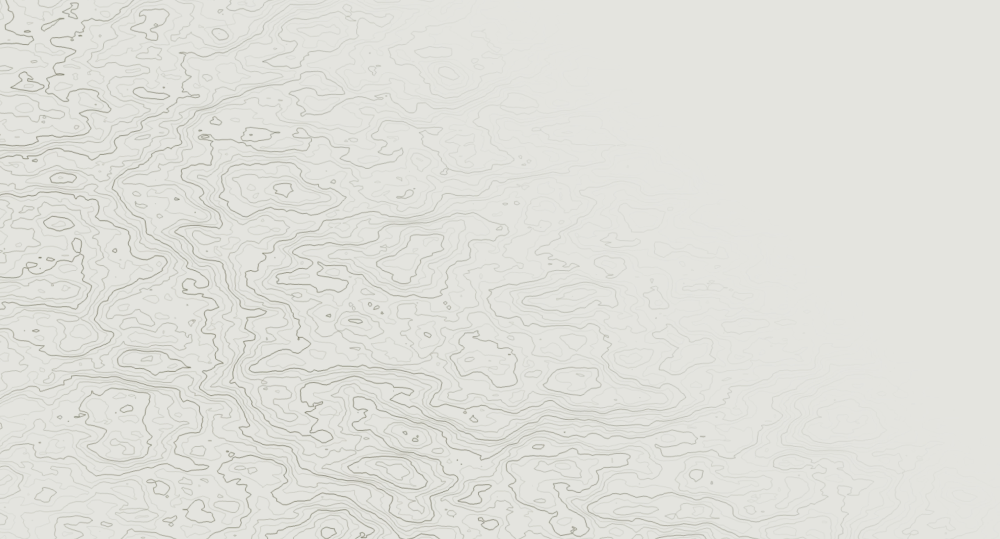

# Contour Line Animation

A sweeping corner-to-corner animation of contour lines. The topographic map regenerates with each sweep.

This project is an introduction to graphics programming and generative art using Three.js. The goal is to explore visual computation, motion, and procedural design while improving my understanding of Three.js and 3D graphics concepts.

